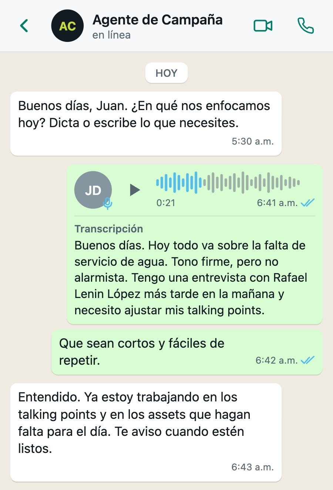
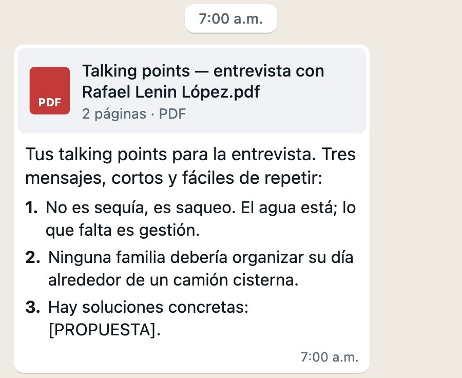
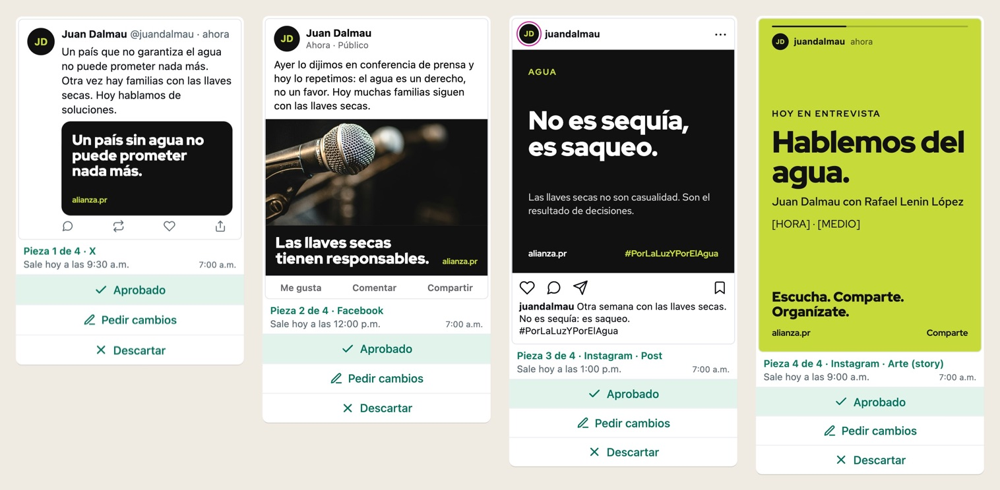
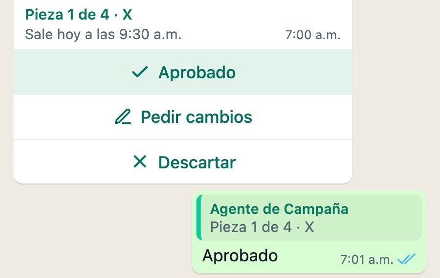
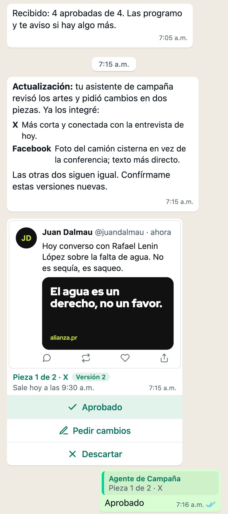
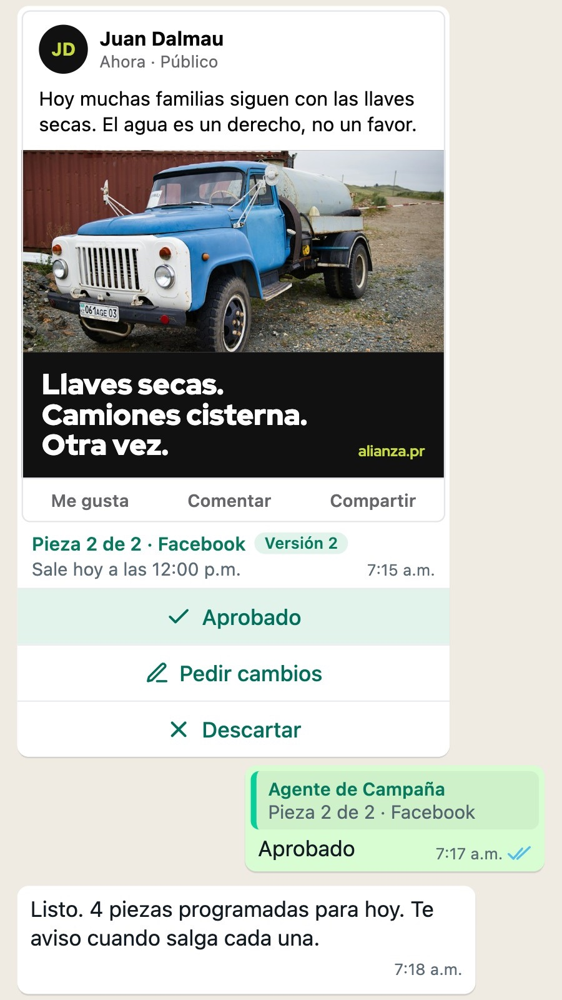

# Presentación pre-MVP

**Un asistente de campaña en WhatsApp que redacta las piezas del día, y una candidata que las aprueba una por una**

Redactado: 2026-09-29

---

## La idea

Cada mañana una campaña tiene que decidir qué va a decir ese día y convertirlo en piezas para redes. Eso cuesta horas del equipo y una candidata a la que es difícil encontrar.

El Agente de Campaña hace la redacción. La candidata decide desde su propio teléfono, en WhatsApp, donde ya pasa el día. No instala nada ni aprende una pantalla nueva.

## Cómo va una mañana

Las capturas son del prototipo, tal como la candidata lo ve en su teléfono.

1. El Agente de Campaña le escribe a la candidata por WhatsApp y le pregunta en qué se enfocan hoy.
2. La candidata contesta con una nota de voz: el tema, el tono, lo que tiene en agenda.

   

3. El agente le devuelve los puntos de mensaje en un PDF, sacados solo de lo que la candidata ya ha dicho en público. Cada punto cita de dónde sale. Donde falta un dato, el agente deja un hueco a la vista en vez de inventarlo.

   

4. El agente propone cuatro piezas. Cada una llega como su propia tarjeta: una imagen de cómo se verá la pieza, la red, la hora a la que saldría y tres botones: **Aprobado**, **Pedir cambios** y **Descartar**.

   

5. La candidata toca un botón en cada tarjeta.

   

6. El equipo de campaña, desde una pantalla en una computadora, puede pedir cambios. La candidata también, por texto o por nota de voz. El agente manda versiones nuevas, y cada versión nueva necesita una aprobación nueva.

   

7. A su hora, cada pieza aprobada sale. Una versión que nadie aprobó no sale.

   

8. La pantalla del equipo guarda el registro completo: cada versión, quién aprobó cuál y lo que costó cada paso.

## La regla

Nada sale sin que una persona con nombre apruebe esa versión exacta. Cambiar una pieza anula su aprobación.

## La demostración

Dura unos quince minutos y hacen falta dos personas. La candidata sostiene su propio teléfono. Alguien opera la pantalla del equipo en una computadora que el público puede ver.

- **Real:** la conversación de WhatsApp, la transcripción de la voz, la redacción, los puntos de mensaje, los artes y las aprobaciones.
- **Simulado:** la publicación y el calendario de la candidata. Un reloj de demostración adelanta el día, y ninguna pieza llega a una cuenta real.
- **Sin imágenes hechas con IA.** Los artes salen de plantillas, de las fotos de la propia campaña y de su identidad visual.

## Qué protege

- **Ningún dato de votantes, donantes ni afiliados.** No hay listas de contactos, y no se carga ninguna.
- **No publica nada.** No tiene acceso a ninguna cuenta de redes sociales.
- **El único dato personal es el de la candidata:** sus mensajes, sus notas de voz y las fotos que aporta la campaña. Se le dice antes que su voz pasa por un servicio de transcripción y sus mensajes por un proveedor de modelos de IA.
- **Todo se borra al terminar**, salvo que la campaña pida quedarse con el registro.
- **Cada campaña va aparte.** Nada de una aparece en la demostración de otra.

## Qué aporta cada campaña

- Entre cinco y diez fotos que la campaña tenga derecho a usar.
- Su identidad visual, o el permiso para usar la de su partido.
- Sus cuentas públicas en cada red.
- Tres a cinco temas, con lo que la candidata ya ha dicho en público sobre cada uno.
- El número de WhatsApp de la candidata y su visto bueno.
- Una hora de alguien del equipo para ensayar.

## Qué no es

- **No está atada a WhatsApp.** La demostración usa WhatsApp porque es donde ya están las candidaturas. En producción es muy probable que haga falta otro canal: los términos comerciales de WhatsApp prohíben la actividad de partidos políticos.
- **Todavía no es un producto.** Si una campaña quiere seguir usándolo al día siguiente, la respuesta honesta es *todavía no*.
- **No prueba lo que costaría.** Enseña lo que cuesta una mañana, no lo que pagaría una campaña.
